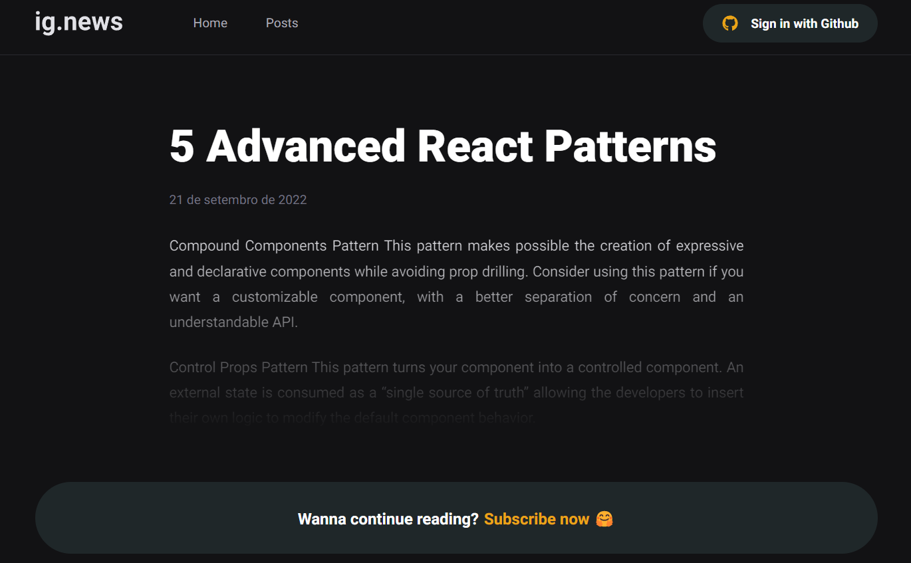

<div id="top" align="center">
  <div>
    
  </div>
  <h4 align="center">ig.news | News about the React world.</h4>
</div>

## Resumo

  <ol>
    <li><a href="#visão-geral-do-projeto">Visão geral do projeto</a></li>
    <li><a href="#sobre-o-projeto">Sobre o projeto</a></li>
    <li><a href="#tecnologias-utilizadas">Tecnologias utilizadas</a></li>
    <li><a href="#instalação-e-utilização">Instalação e utilização</a></li>
    <li><a href="#anotações-pessoais">Anotações Pessoais</a></li>
    <li><a href="https://zeh-ignews.vercel.app/">Deploy no Vercel - Clique aqui e veja a obra de arte</a></li>
    
  </ol>

## Visão geral do projeto

<div>
  <h3 >
    
    <a href="https://www.figma.com/file/gl0fHkQgvaUfXNjuwGtDDs/ig.news?node-id=1%3A2">Layout no Figma</a>
  </h3>
</div>

<div align="center">
    
    
</div>

## Sobre o projeto

O ig.news é uma página de noticias sobre o universo React. Os usuários poderão realizar a assinatura dos conteúdos por apenas $9.90 ao mês. Antes de realizar uma assinatura na aplicação, o usuário deverá se cadastrar através do login com github. Logo após, será possível assinar os conteúdos, onde o pagamento é feito através de cartão de crédito pela plataforma do Stripe.

Caso o usuário não tenha uma assinatura de conteúdo na aplicação, ele ainda poderá ter acesso a listagem de postes, podendo fazer uma breve leitura dos postes de seu interesse, como mostrado na imagem acima.

## Tecnologias utilizadas

As principais tecnologias utilizadas na construção deste projeto foram: 

* [Next.js](https://nextjs.org/)
* [Fauna Data API](https://fauna.com/)
* [Stripe Payments](https://stripe.com/en-br)
* [Prismic CMS](https://prismic.io/)
* [Sass CSS](https://sass-lang.com/)
* [Axios HTTP Client](https://axios-http.com/docs/intro)

## Instalação e utilização

Ferramentas necessárias para execução do projeto

1. Node
2. Yarn
3. Stripe CLI

  
### Executar projeto

1. Baixe as dependências do projeto com o comando `$ yarn`.
2. Crie o arquivo `.env.local`, tendo como exemplo o arquivo `.env.example`.
3. Preencha os valores das variáveis ambiente do arquivo `env.local`:

* [Stripe](https://dashboard.stripe.com/)
* [Github](https://github.com)
* [Fauna](https://fauna.com/)
* [Prismic](https://prismic.io/)

4. Para ouvir os Webhooks do stripe, incie a CLI com o comando `$ stripe listen --forward-to localhost:3000/api/webhooks`. 

* [Instalar Stripe CLI](https://stripe.com/docs/stripe-cli)

5. Execute o projeto com o comando `$ yarn dev`. localhost:3000

## Anotações Pessoais

### 1. Pasta Public
Onde as imagens e o favicon devem estar. Para carregar imagens dentro do projeto
basta indicar o seguinte caminho no atríbuto src da img da seguinte forma:
/images/logo.svg

### 2. Pasta SRC
A pasta SRC não existe de forma padrão em um projeto Nextjs, mas é possível
cria-la para que haja uma melhor organização no código.

#### 2.1. Pasta Pages
A pasta PAGES pode estar em apenas dois locais da nossa aplicação, sendo na raiz
do projeto, ou diretamente dentro da pasta SRC.

#### 2.2. File System Routing
Em projetos Nextjs, cada arquivo presente dentro da pasta PAGES é convertido em
uma rota da aplicação, existem excessões como o _app.tsx e _document.tsx, que 
serão abordadas a seguir.

#### 2.3. Export como default
Quando criamos um componente dentro da pasta PAGES, o mesmo deve ser exportado
como DEFAULT.

#### 2.4. Arquivo pages/_app.tsx
O arquivo _app.tsx é o primeiro arquivo a ser carregado pela aplicação, e cada
alteração de tela no browser o mesmo é recarregado de forma completa. Nele devem 
estar contidas todas as informações de PROVIDERS (hooks wrappers). Se em algum 
momento existir um componente que deve estar presente em todas as abas da 
aplicação, o mesmo também deverá estar presente dentro deste arquivo, um exemplo 
prático seria o header.tsx. No caso do ignews o header está presente em todas 
as abas então o mesmo deve ser carregado dentro do app.

#### 2.5. Arquivo pages/_document.tsx
O arquivo _document.tsx funciona de forma semelhante ao _app.tsx, e também pode
ser comparado ao arquivo index.html dentro da pasta PUBLIC em projetos React
comuns. Nesse arquivo devem estar contidas informações que serão carregadas
APENAS UMA VEZ na aplicação, um exemplo prático disso seriam as fontes. O código
dentro do arquivo deve ser escrito no formato de CLASS, pois ainda não há um 
suporte muito legal a FUNCTIONAL COMPONENTS.

### 3. API ROUTES
Entre a camada do browser e a camada do backend, existe a camada do Nextjs, que
executa o servidor Node. Essa camanda permite que em alguns casos um backend
dentro do frontend seja criado. A API ROUTE pode conter variáveis ambiente que 
não estarão disponíveis para o cliente. Cada arquivo dentro da pasta /pages/api
pode ser comparado a uma rota do backend. Todas as API ROUTES são executadas 
utilizando o conceito de Serverless, dessa forma, a cada requisição executada 
uma nova estância é criada, divergindo do que acontece com as sessões nos métodos
mais convencionais.

#### 3.1. Parâmentros nas rotas
Ao nomear os arquivos das rotas é possível indicar se a mesma vai receber algum
parâmentro ou não. Vamos imaginar que desejamos listar todos os usuários da 
aplicação, para isso basta criar um arquivo /api/users.ts. Caso seja necessário
fazer uma busca por um usuário específico, o arquivo poderia se chamar 
/api/[userId].ts, e para resgatar o valor dentro do arquivo seria da seguinte
forma: const {userId} = request.query. Para obter-se acesso a vários parâmentros
da rota ao mesmo tempo, o arquivo deve ser nomeado usando spread operator:
/api/[...params].ts, onde os resultados do request.query formam um objeto de 
parâmetros. 

### 4. Variáveis Ambiente
Devem estar disponíveis apenas para a parte backend do app. Dessa forma apenas as
API routes, os métodos Server Side Rendering e os métodos Get Static Props devem
visualizar as informações das variáveis. Pois as mesmas não devem ficar visíveis
para o cliente

### 5. Dicas de código
```js
// formatanado json no console.log
console.log(JSON.stringify(response, null, 2))

// clonando elemento React
return (
  <Link {...rest}>
    {cloneElement(children, { className })}
  </Link>
)

// inserindo html perigosamente
<div dangerouslySetInnerHTML={{ __html: post.content }} />
```

<br/>

<h4 align="center"><a href="#top">Voltar ao Início</a></h4>


